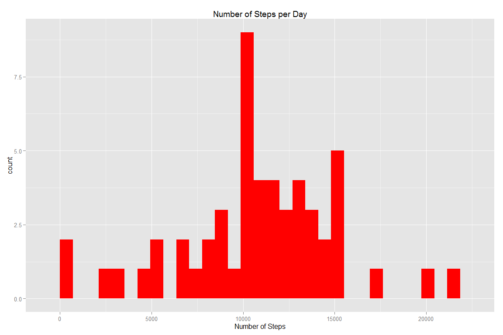
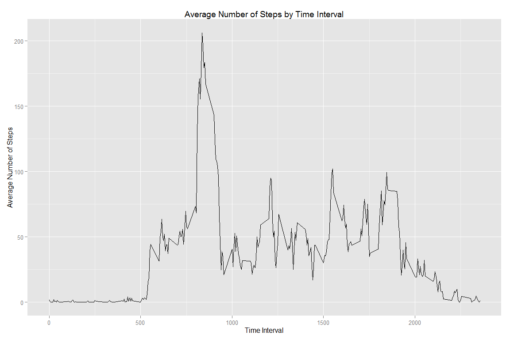
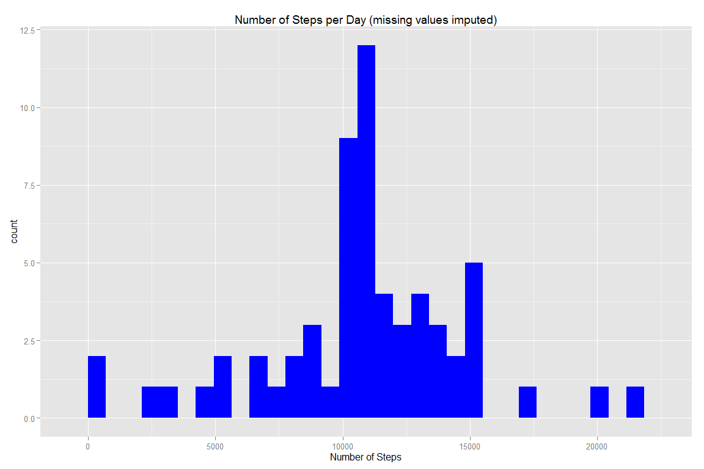
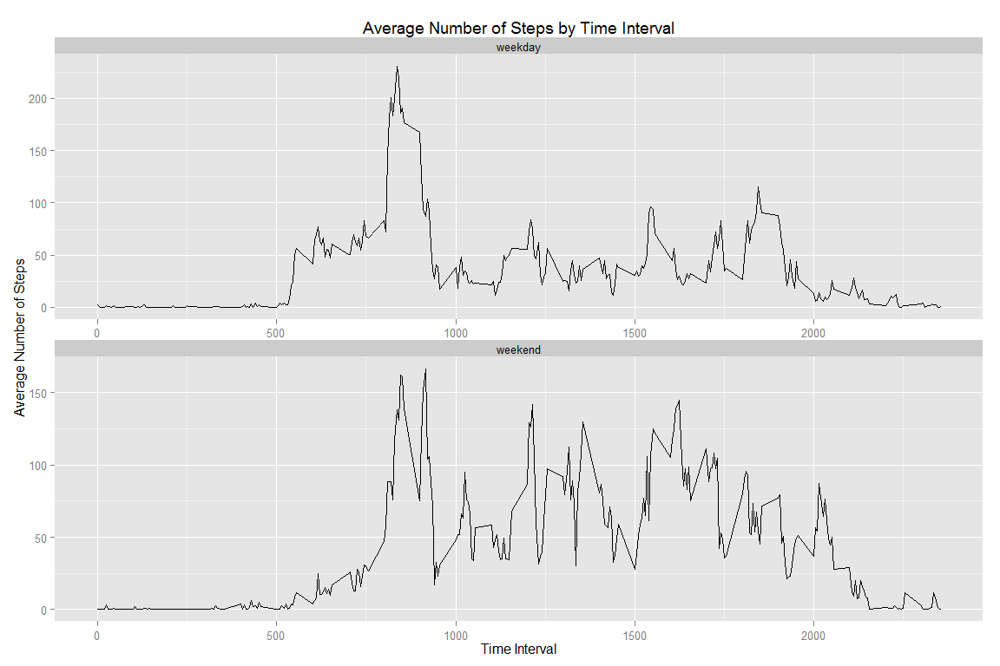

# Reproducible Research: Peer Assessment 1


## Loading and preprocessing the data


```r
library(dplyr)
library(ggplot2)

unzip("Activity.zip")
data <- read.csv("activity.csv")
data$date <- as.Date(data$date)
```


## What is mean total number of steps taken per day?


```r
options(digits=2)
(Q1 <- data %>% 
      na.omit() %>%
      group_by(date) %>%
      summarise(steps = sum(steps)) %>%
      within(., {
            assign("mean_sbd", mean(.$steps, na.rm = TRUE), env = .GlobalEnv)
            assign("median_sbd", median(.$steps, na.rm = TRUE), env = .GlobalEnv)
      }) %>%
      ggplot(aes(steps)) + 
      geom_histogram(fill = "red") +
      xlab("Number of Steps") + 
      ggtitle("Number of Steps per Day"))
```

 

- The mean of the total number of steps taken per day is **10766.19**   
      
- The median of the total number of steps taken per day is **10765**


## What is the average daily activity pattern?


```r
(Q2 <- data %>% 
      na.omit() %>%
      group_by(interval) %>% 
      summarise(steps = mean(steps, na.rm = TRUE)) %>%
      within(., assign("max_spi", 
                       as.numeric(.[.$steps == max(.$steps, na.rm = TRUE), 1]), 
                       env = .GlobalEnv)) %>%
      ggplot(aes(x = interval, y = steps)) + 
      geom_line() +
      xlab("Time Interval") + 
      ylab("Average Number of Steps") +
      ggtitle("Average Number of Steps by Time Interval"))
```

 

```r
max_time <-  paste(substr(max_spi, 1, nchar(max_spi)-2),
                  substr(max_spi, nchar(max_spi)-2+1, nchar(max_spi)), 
                  sep=":") %>%
            strptime(., format="%H:%M") %>%
            strftime(.,format="%H:%M")
```

- The 5 minute time interval that contains the maximum average number of steps is at **08:35** 


## Imputing missing values

- The total number of missing values in the dataset is 2304

- Missing values will be imputed based on the average value for that time interval across all days


```r
Q3_prep <- data %>% 
      within(., {
            assign("complete_cases",  filter(., complete.cases(.)), 
                   env = .GlobalEnv)
            assign("missing_cases", filter(., !complete.cases(.)) %>%  
                         select(., 2:3), 
                   env = .GlobalEnv) 
            assign("imputed_cases", na.omit(.) %>%
                         group_by(interval) %>% 
                         summarise(steps = mean(steps, na.rm = TRUE)) %>%
                         right_join(missing_cases, by = "interval") , 
                   env = .GlobalEnv)
            assign("imputed_data", bind_rows(complete_cases, imputed_cases),
                   env = .GlobalEnv)
      }) 
rm(Q3_prep, complete_cases, missing_cases, imputed_cases)
      
(Q3 <- imputed_data %>%
      na.omit() %>%
      group_by(date) %>%
      summarise(steps = sum(steps)) %>%
      within(., {
            assign("mean_sbd_complete", mean(.$steps, na.rm = TRUE), 
                   env = .GlobalEnv)
            assign("median_sbd_complete", median(.$steps, na.rm = TRUE), 
                   env = .GlobalEnv)
      }) %>%
      ggplot(aes(steps)) + 
      geom_histogram(fill = "blue") +
      xlab("Number of Steps") + 
      ggtitle("Number of Steps per Day (missing values imputed)"))
```

 

- After imputing missing values, the mean of the total number of steps taken per day is **10766.19**  
      
- After imputing missing values, the median of the total number of steps taken per day is **10766.19**

- These values do not differ from the estimates from the first part of the assignment because per interval averages were used to estimate the average daily step values for the missing dates, i.e. the average daily number of steps that were added to the dataset as a result of imputation are the same as the average daily number of steps in the existing non-missing data set.  Imputing the missing data did increase both the *total number of dates counted* and the *total number of steps counted* in the analysis, but because steps per day were imputed from the existing data, the average daily number of steps remained the same.


## Are there differences in activity patterns between weekdays and weekends?


```r
Q4_prep <- imputed_data %>%
      within(., {
            assign("weekdays",  
                   mutate(., day = as.factor(weekdays(as.Date(date), 
                                                        abbreviate = TRUE))) %>%
                   filter(!day %in% c('Sat','Sun')) %>%
                  mutate(wday = "weekday"),
                   env = .GlobalEnv)
            assign("weekends", 
                   mutate(., day = as.factor(weekdays(as.Date(date), 
                                                      abbreviate = TRUE))) %>%
                   filter(day %in% c('Sat','Sun')) %>%  
                  mutate(wday = "weekend"),
                   env = .GlobalEnv) 
            assign("weekday_data", bind_rows(weekdays, weekends) %>%
                         within(., wday <- as.factor(wday)),
                   env = .GlobalEnv)
      }) 

(Q4 <- weekday_data %>%
      na.omit() %>%
      group_by(wday, interval) %>%
      summarise(steps = mean(steps)) %>%
      ggplot(aes(x = interval, y = steps, group = wday)) + 
      facet_wrap(~wday, nrow=2, scales="free") +
      geom_line() +
      xlab("Time Interval") + 
      ylab("Average Number of Steps") +
      ggtitle("Average Number of Steps by Time Interval"))
```

 

```r
mean_weekend <- weekends %>%
      group_by(date) %>%
      summarise(steps = sum(steps))

mean_weekday <- weekdays %>%
      group_by(date) %>%
      summarise(steps = sum(steps))
```


- The average number of steps taken per weekend is **12201.52**  
      
- The average number of steps taken per weekday is **10255.85**

As expected, average steps during daytime hours are lower on weekdays (when most people are at work) and higher on weekends (when many people are outdoors).  Also, weekends have lower peak steps per time interval (i.e. less activity at peak times) but, as also expected, higher overall average steps per day (12201.52 average steps on weekends vs 10255.85 average steps on weekdays).

